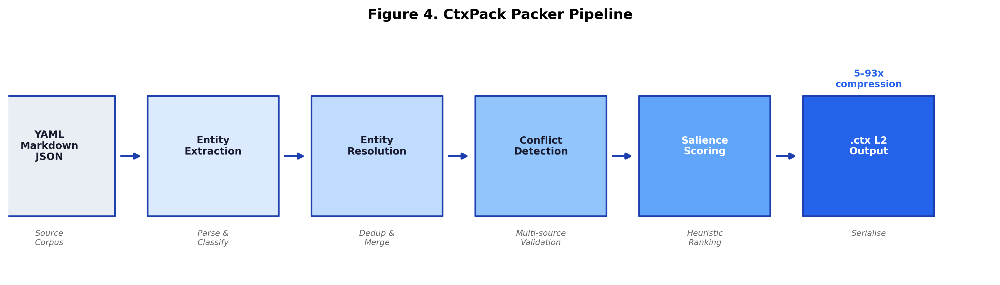
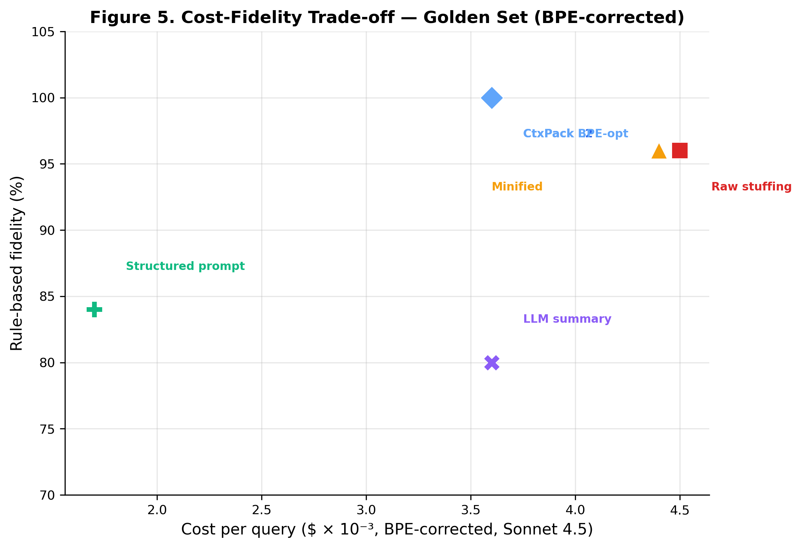
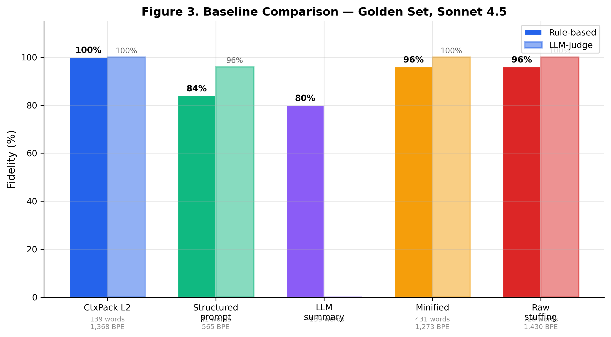
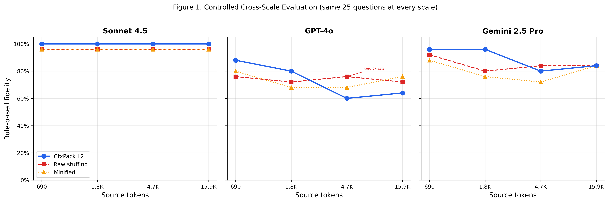
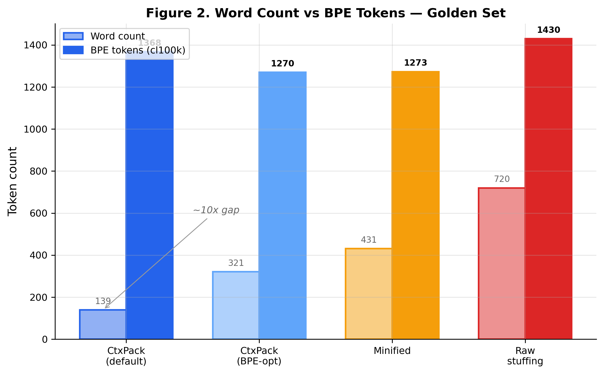

# CtxPack: Perceptual Context Compression for Large Language Models

**Kapil Pant**
Independent Researcher

**Abstract.** Large language models consume context tokens linearly in cost and quadratically in attention computation, yet most injected context — domain rules, entity definitions, operational knowledge — contains significant structural redundancy. We present CtxPack, an open-source, deterministic context compression codec that exploits the gap between *information density as written for humans* and *information density as consumed by transformers*. CtxPack introduces `.ctx`, a multi-resolution text format with a formal grammar, and a packer that converts structured domain corpora (YAML, Markdown, JSON) into semantically compressed context through entity resolution, deduplication, heuristic salience scoring, and hierarchical notation. In controlled evaluations across 12 models from 3 ecosystems (Anthropic, OpenAI, Google) — including frontier models (Claude Sonnet 4.5, GPT-5.2 Pro), reasoning models (o3, o4-mini), and lightweight models (Haiku 4.5, Gemini 2.5 Flash Lite) — CtxPack's L2 notation achieves a 92–100% fidelity floor at 139 tokens, with 4 models reaching 100%. Critically, L2 fidelity meets or exceeds L1 on 11 of 12 models, demonstrating that compact semantic notation is at least as effective as natural-language prose at one-third the token cost. In cross-ecosystem scaling evaluations across 5 models from 3 ecosystems at corpus sizes from 690 to 37,000 tokens, CtxPack surpasses raw context stuffing on 4 of 5 models at the 37K crossover point — with one model (Haiku 4.5) showing a 60 percentage point advantage — confirming that the lost-in-the-middle effect generalises across ecosystems and that structured compression becomes *required for correctness* at production corpus sizes. Real-world validation on FDA drug labels (93x compression, 96–100% LLM-judge fidelity) and Twilio Video API documentation (8.7x compression, 84–100% rule-based fidelity) confirms that the codec generalises beyond synthetic benchmarks to production-representative content from distinct domains.¹ We release the codec, evaluation framework, cross-ecosystem results, and all raw API logs under AGPL-3.0.

¹ All token counts use whitespace-split word count; BPE token counts used for API billing are ~10× higher for dense `.ctx` notation. Cost analysis uses BPE-corrected figures and a fidelity-per-dollar framing (Sections 5.8, 5.14).

---

## 1. Introduction

The economic and computational cost of LLM context windows creates a fundamental tension: organizations possess rich domain knowledge (data contracts, entity definitions, business rules, regulatory policies) that dramatically improves LLM output quality when injected as context, but the cost of injecting this knowledge scales linearly with token count at $3–15 per million input tokens for frontier models. A 40,000-token domain corpus costs $0.12–0.60 per query — prohibitive for production systems handling thousands of daily requests.

Existing approaches to this problem fall into three categories, each with significant limitations:

**Token-level compression** (LLMLingua [Jiang et al., 2023], Selective Context [Li et al., 2023]) removes tokens deemed low-information by a smaller model. These methods achieve 2–5x compression but operate without semantic understanding, risking removal of structurally critical tokens (entity identifiers, threshold values, relationship markers) that are lexically common but semantically load-bearing.

**Embedding-based compression** (Gist Tokens [Mu et al., 2023], AutoCompressors [Chevalier et al., 2023]) project context into continuous vector representations. These achieve high compression ratios but produce opaque, non-inspectable representations that cannot be cached across sessions, versioned, debugged, or audited — requirements in regulated industries.

**Retrieval-augmented generation** (RAG) avoids full-corpus injection by retrieving relevant chunks per query. However, RAG introduces its own failure modes: retrieved chunks are redundant (the same fact appears across multiple chunks), critical cross-entity relationships span chunk boundaries, and information positioned in the middle of retrieved context is systematically ignored by transformer attention (Liu et al., 2023).

CtxPack takes a fundamentally different approach: lossy structured compression, analogous in spirit to perceptual audio codecs. MP3 exploits a psychoacoustic model to discard information the ear cannot perceive. CtxPack similarly exploits how LLMs consume structured context: entity-relationship hierarchies compress into dense notation without information loss because the model reconstructs the full semantics from structural cues, while prose filler words ("the", "is used for", "this means that") can be stripped without affecting comprehension. The analogy is imperfect — CtxPack does not learn a perceptual model but uses heuristic salience scoring — yet the design principle (discard what the consumer cannot distinguish from the original) is shared.

### 1.1 Contributions

1. **The `.ctx` format**: A formal, multi-resolution text compression format with a PEG grammar, three conformance levels (L1: structured prose, L2: semantic graph notation, L3: abstract gist), and a defined operator alphabet for entity relationships, status flows, retention policies, and cross-references (Section 3).

2. **A deterministic packer**: A pure-Python, zero-dependency pipeline that converts YAML + Markdown + JSON domain corpora into `.ctx` L2 output through entity extraction, resolution, deduplication, conflict detection, and heuristic salience scoring (Section 4).

3. **Cross-ecosystem empirical evidence**: Controlled evaluations across 12 models from 3 ecosystems (Anthropic, OpenAI, Google) demonstrating a 92–100% fidelity floor on L2 notation, with L2 meeting or exceeding L1 fidelity on 11 of 12 models (Section 5). Cross-ecosystem scaling across 5 models confirms the crossover point where CtxPack surpasses raw stuffing at 37K tokens (Section 5.3).

4. **Real-world corpus validation**: Evaluations on two public-domain corpora — FDA drug labels (pharma/healthcare) and Twilio Video API documentation (communications/DevOps) — confirming that the codec generalises beyond synthetic benchmarks (Section 5.4).

5. **A counterintuitive finding**: At the per-question level, the packer's scope inference (Section 4.2) disambiguates implicit qualifiers that models misread in raw YAML, producing higher-fidelity answers on specific questions. The codec does not merely preserve information — it can clarify it (Section 5.6).

6. **A new finding — structured compression benefits smaller models disproportionately**: At 37K tokens, Haiku 4.5 achieves 96% fidelity on CtxPack but only 36% on raw context — a 60pp delta. The format compensates for reduced model capacity by pre-structuring information, with direct implications for cost-optimised deployment architectures (Section 5.3).

7. **An open evaluation framework**: A reproducible benchmark with 25 curated questions (including adversarial hallucination traps), dual grading (rule-based + LLM-as-judge), a scaling corpus generator, real-world corpus downloaders, and complete raw logs of all API calls — released under AGPL-3.0.

8. **Agent context compression**: A proof-of-concept demonstrating the format's applicability beyond static knowledge packing — compressing a 30-step coding agent trace into structured `.ctx` output with entity merging and provenance tracking in sub-millisecond latency (Section 5.9).

9. **Ablation studies**: Isolated contribution of scope inference (+0–4pp, model-dependent) and salience ordering (+8pp on GPT-4o, within noise on Sonnet/Gemini). Minified JSON/YAML baseline confirms CtxPack's advantage is structural compression, not whitespace removal (Section 5.10–5.11). Structured-prompt baseline ("LLM-as-packer") tests the strongest possible competitor (Section 5.10.1). Controlled cross-scale evaluation with fixed questions isolates the dilution effect and reveals a model-dependent counter-result on GPT-4o (Section 5.12). Tokenizer mapping quantifies the gap between word-split and BPE token counts, and a BPE-optimised serialisation mode reduces the gap by ~6–10% (Sections 5.13–5.14).

---

## 2. Related Work

### 2.1 Token-Level Context Compression

LLMLingua (Jiang et al., 2023) uses a small language model to compute per-token perplexity and removes low-perplexity tokens. LongLLMLingua (Jiang et al., 2024) extends this with question-aware compression for RAG scenarios. Selective Context (Li et al., 2023) applies a similar approach using self-information to identify and remove low-information-content tokens. These methods operate at the token level without understanding document structure, making them effective for narrative prose but poorly suited for structured domain knowledge where every field name, threshold value, and entity reference carries high information density regardless of lexical frequency.

### 2.2 Learned Soft Compression

Gist Tokens (Mu et al., 2023) train a model to compress instructions into a small number of virtual tokens in the embedding space. AutoCompressors (Chevalier et al., 2023) extend this to multi-step compression. ICAE (Ge et al., 2024) uses an autoencoder approach. While achieving very high compression ratios (10–25x), these methods produce opaque representations that cannot be inspected, cached as text, version-controlled, or audited. They also require training or fine-tuning, limiting applicability to specific model families.

### 2.3 Retrieval-Augmented Generation

RAG (Lewis et al., 2020) retrieves relevant document chunks at query time, avoiding full-corpus injection. However, Liu et al. (2023) demonstrated that LLMs systematically fail to use information positioned in the middle of their context window — the "lost-in-the-middle" phenomenon. RAG pipelines typically retrieve 10–20 chunks (15–25K tokens), introducing redundancy across chunks and fragmentation of cross-entity relationships. CtxPack is complementary to RAG: it can serve as a post-processing layer that compresses retrieved chunks before injection.

### 2.4 Structured Knowledge Representation

Traditional approaches like RDF, OWL, and knowledge graphs represent structured knowledge formally but are not designed for LLM consumption — they require query languages (SPARQL) and inference engines rather than direct context injection. JSON-LD and Schema.org provide structured markup but optimize for machine interoperability, not token efficiency. CtxPack occupies a novel position: a format designed specifically for the LLM-as-consumer use case, balancing human readability, machine parseability, and token density. Concurrently, Gloaguen et al. (2026) demonstrate that unstructured repository-level context files (AGENTS.md) reduce coding agent task success by 0.5–2% while increasing cost 20%+, attributing failures to redundancy and unnecessary requirements — failure modes that CtxPack's entity resolution and salience scoring are designed to address.

---

## 3. The `.ctx` Format

### 3.1 Design Principles

The `.ctx` format is guided by four principles:

1. **Plain text, not binary.** `.ctx` files are UTF-8 text that can be read by humans, diffed with standard tools, and version-controlled in git. This enables domain experts to inspect and validate compressed knowledge without special tooling.

2. **Multi-resolution.** A single document can contain content at different compression levels, enabling progressive hydration — serve L3 (gist) for simple queries, L2 (semantic graph) for detailed questions, L1 (compressed prose) when verbatim detail matters.

3. **Deterministic and reproducible.** Given the same input corpus, the packer produces identical output. No randomness, no model-dependent compression, no floating-point accumulation. The same `.ctx` file produces the same results regardless of when or where it was generated.

4. **Format-aware, not model-specific.** The `.ctx` notation is designed for general transformer consumption, not optimised for any single model's tokeniser. Cross-ecosystem evaluation (Section 5) confirms portability across 12 models from 3 ecosystems while revealing that compact notation is at least as effective as natural-language prose.

### 3.2 Document Structure

A `.ctx` document begins with a header line and contains a sequence of sections:

```
§CTX v1.0 L2 DOMAIN:customer-data-platform
COMPRESSED:2026-02-22 SOURCE_TOKENS:~647

±ENTITY-CUSTOMER ★GOLDEN-SOURCE:CRM-(Salesforce)
IDENTIFIER:customer_id(UUID,immutable)
MATCH-RULES:[email:exact-match(case-insensitive),
  phone:normalise(E.164),
  name+address:fuzzy-match(Jaro-Winkler>0.92)]
PII:name+email+phone+address→RESTRICTED
RETENTION:active→indefinite|churned→36mo→anonymise

±ENTITY-ORDER
IDENTIFIER:order_id(UUID,immutable)
BELONGS-TO:@ENTITY-CUSTOMER(customer_id,mandatory)
STATUS-MACHINE:draft→submitted→processing→shipped→delivered
FINANCIAL-FIELDS:[subtotal,tax,shipping_cost,total]→DECIMAL(19,4)
```

### 3.3 Operator Alphabet

The L2 notation uses a defined set of operators:

| Operator | Meaning | Example |
|----------|---------|---------|
| `§` | Document header | `§CTX v1.0 L2` |
| `±` | Section boundary | `±ENTITY-CUSTOMER` |
| `→` | Flow / transition | `draft→submitted→delivered` |
| `\|` | Alternative / branch | `active→indefinite\|churned→36→anonymise` |
| `+` | Conjunction / list | `name+email+phone` |
| `★` | High-salience marker | `★GOLDEN-SOURCE:CRM` |
| `⚠` | Warning / conflict | `⚠ Retention conflict detected` |
| `@` | Entity cross-reference | `@ENTITY-CUSTOMER` |
| `¬` | Negation / exclusion | `¬FLOAT-for-financial` |

These operators are chosen for their visual distinctiveness to transformer tokenizers. Unicode operators (`→`, `★`, `⚠`) tokenize as single or two-token units in most tokenizers, providing high information density per token.[^1]

[^1]: We did not measure tokenizer-specific token counts for the `.ctx` output across models. The token counts reported throughout use whitespace-split approximation. Actual tokenizer differences between models may produce slightly different effective token counts and compression ratios. We expect the difference to be small (<10%) given the operator-dense, ASCII-heavy nature of the format, but precise cross-tokenizer measurement is left to future work.

### 3.4 Conformance Levels

The format defines three conformance levels:

- **L1 (Compressed Prose):** Filler words removed, sentences shortened, but natural language structure preserved. Readable by non-technical stakeholders.
- **L2 (Semantic Graph):** Entity-relationship notation with operators. The primary level for domain knowledge packing. Human-readable with brief familiarization.
- **L3 (Abstract Gist):** Maximally compressed summaries using entity references and operator chains. Suitable for system prompts and routing decisions.

### 3.5 Formal Grammar

The format is specified by a PEG grammar (105 production rules). A compliant parser is provided as a recursive-descent implementation in pure Python (410 lines, zero external dependencies). The parser handles all three conformance levels and produces a frozen-dataclass AST (CTXDocument, Header, Section, KeyValue, InlineList, PlainLine, QuotedBlock).

---

## 4. The Packer

### 4.1 Pipeline Overview

The packer converts a directory of YAML, Markdown, and JSON source files into a single `.ctx` L2 document through a six-stage pipeline (Figure 4):



```
Discover → Parse → Entity Resolve → Conflict Detect → Score → Compress
```

**Stage 1: Discovery.** Walk the corpus directory, classify files by extension (.yaml/.yml, .md, .json), and load optional `ctxpack.yaml` configuration (domain name, entity aliases, golden source mappings, include/exclude patterns).

**Stage 2: Parsing.** YAML files are parsed by a stdlib-only subset parser (722 lines, handling maps, sequences, nested structures, flow notation, and scalars; rejecting anchors, tags, and multi-line scalars with clear error messages). Markdown files are parsed by a heading/list extractor that maps H1/H2 headings to entity boundaries and bullet lists to rules. JSON files are parsed with support for JSON Schema entity definitions and nested arrays. All parsers produce an intermediate representation (IR) of entities, fields, and warnings.

**Stage 3: Entity Resolution.** Entities from multiple source files are merged through a four-strategy cascade: exact name match → case-insensitive match → configured alias match → singular/plural match. Fields are deduplicated by key + value identity, with provenance tracked across all sources.

**Stage 4: Conflict Detection.** A rule-based conflict detector identifies contradictions across the resolved corpus: retention policy conflicts (e.g., entity says 36 months, regulation says 7 years), null-policy contradictions (never-null vs. nullable for the same field), type mismatches, and PII classification inconsistencies. Detected conflicts are surfaced as `⚠` warnings in the output.

**Stage 5: Salience Scoring.** Each entity and field receives a salience score determining its position and inclusion priority in the output. The Phase 1 scorer uses a heuristic formula:

$$\text{entity\_score} = (\text{source\_count} \times 1.0 + \text{cross\_refs} \times 2.0 + \text{warnings} \times 1.5) \times \text{golden\_boost}(1.5)$$

Fields are boosted by marker presence (★: 2.0x), warning presence (⚠: 1.5x), and high-value key types (IDENTIFIER, PII, MATCH-RULES: 1.3x). Entities are sorted by descending salience in the output, placing the most important information at the beginning and end of the context — the positions where transformer attention is strongest (Liu et al., 2023).

**Stage 6: Compression.** The scored IR is converted to a CTXDocument AST bottom-up. Entity fields are compressed according to type-specific rules:

| Source Pattern | Compressed Notation |
|---|---|
| `identifier: {name: X, type: T, immutable: true}` | `IDENTIFIER:X(T,immutable)` |
| `retention: {active: indef, churned: {months: 36, action: anonymise}}` | `RETENTION:active→indefinite\|churned→36→anonymise` |
| `status_flow: [draft, submitted, ..., delivered]` | `STATUS-MACHINE:draft→submitted→...→delivered` |
| `pii: [name, email, phone] + pii_classification: RESTRICTED` | `PII:name+email+phone→RESTRICTED` |
| `belongs_to: {entity: CUSTOMER, field: cust_id, mandatory: true}` | `BELONGS-TO:@ENTITY-CUSTOMER(cust_id,mandatory)` |

### 4.2 Scope Inference

A notable packer behavior is *scope inference* from entity descriptions. When an entity's identifier has a boolean `unique: true` flag and the entity description mentions a scope qualifier ("one per merchant", "per tenant", "per organization"), the packer enriches the compressed identifier:

```yaml
# Source YAML
entity: PRODUCT
description: Product catalog entity, one per merchant
identifier:
  name: sku
  type: string
  unique: true
```

```
# Compressed .ctx
±ENTITY-PRODUCT
IDENTIFIER:sku(string,unique-per-merchant)
```

The raw YAML states `unique: true` without specifying scope. The packer infers `unique-per-merchant` from the description field. This is a form of *disambiguation during compression* — the codec makes implicit knowledge explicit, improving downstream LLM comprehension (see Section 5.6 for empirical evidence).

This inference is implemented through pattern matching against a fixed set of scope markers ("per merchant", "per tenant", "per organization", etc.) and can be disabled via a `--strict` flag for environments where only explicit field values should be preserved.

### 4.3 L1 Serialization

In addition to the primary L2 output, the packer supports L1 (compressed prose) serialization. L1 output preserves natural language structure — sentences are shortened and filler words removed, but the result reads as conventional prose with headings and bullet points. This provides a baseline for evaluating whether L2's compact notation imposes a comprehension cost: if models perform equally well on L1 and L2, the notation itself is not a barrier. The L1 serializer produces output approximately 3x larger than L2 (417 vs. 139 tokens on the golden set), establishing the cost-fidelity tradeoff between the two conformance levels.

### 4.4 Implementation

The packer is implemented in pure Python with zero external dependencies (2,407 lines across 10 modules). The YAML subset parser avoids the need for PyYAML. All operations are deterministic and reproducible. The implementation is packaged as a CLI tool (`ctxpack pack <corpus-dir>`) and a Python API (`from ctxpack.core.packer import pack`).

---

## 5. Evaluation

### 5.1 Methodology

We evaluate CtxPack on two axes: **compression efficiency** (ratio of source tokens to compressed tokens) and **information fidelity** (percentage of factual questions correctly answered by an LLM using only the compressed context).

**Golden Set.** A fixed corpus of 10 source files (4 entity YAMLs, 2 rule YAMLs, 3 Markdown documents, 1 configuration YAML) representing a customer data platform domain. The corpus contains 4 entities (CUSTOMER, ORDER, PAYMENT, PRODUCT) with cross-entity relationships, 2 planted retention-policy conflicts, entity aliases, and operational tribal knowledge. Total source size: 690 tokens.

**Questions.** 25 question-answer pairs graded by difficulty:
- **Easy** (7): Direct field lookups (e.g., "What type is the customer_id field?")
- **Medium** (11): Multi-field extraction requiring inference (e.g., "What matching algorithm is used for name+address?")
- **Hard** (7): Cross-document conflict detection, adversarial hallucination traps, and cross-entity negation inference

The question set includes 5 adversarial questions: 2 hallucination traps where the correct answer is "not specified in context" (testing whether the LLM confabulates from the compressed representation), 2 low-salience edge cases testing preservation of operationally critical but infrequently referenced details, and 1 cross-entity negation requiring inference of a mandatory relationship constraint.

**Baselines.** We compare five methods at each corpus scale:

1. **Raw stuffing**: Concatenate all source files verbatim (upper bound on information content, lower bound on compression).
2. **Minified JSON/YAML**: Parse YAML/JSON and re-serialize as compact JSON (`separators=(',',':')`); strip Markdown blank lines and collapse whitespace. This isolates whether CtxPack's advantage is whitespace removal or structural compression.
3. **CtxPack L2**: Packer-compressed `.ctx` output (our method).
4. **LLM summary**: Ask the evaluation model to summarize the corpus into the same token budget as CtxPack's output. This is the key competitive baseline — "why not just ask the LLM to summarize?"
5. **Naive truncation**: Take the first N words of the concatenated source to match CtxPack's token count. This establishes a floor.

**Grading.** Each question is graded by two independent methods:

1. **Rule-based grading**: Normalized keyword matching with prefix-aware fuzzy matching. The answer and expected answer are normalized (hyphens/underscores collapsed, punctuation stripped), then key terms (>2 characters) are extracted from the expected answer and matched against the actual answer. A 60% term-match threshold is required. For adversarial "NOT_IN_CONTEXT" questions, the grader checks for explicit signals ("not found in context", "not specified", etc.).

2. **LLM-as-judge**: The same LLM is prompted to compare the candidate answer against the expected answer and respond with CORRECT or INCORRECT. This provides a more nuanced assessment that can recognize semantic equivalence beyond keyword overlap.

Both scores are reported. Rule-based scoring is the primary metric for cross-model comparison (deterministic, reproducible). LLM judge scores are reported as secondary validation. Where discrepancies exceed 8pp, we investigate per-question to determine whether the rule-based grader or judge better reflects answer correctness.[^judge]

[^judge]: For the FDA corpus, the LLM judge is more accurate — rule-based failures are grading artefacts from medical synonym variation (e.g., "approximately 26 hours" vs. "about 26 hours"). For the Twilio corpus, the rule-based grader is more accurate — o4-mini's self-judge sometimes fails to penalise subtle errors. Neither grading approach is uniformly better; the dual methodology surfaces these edge cases for manual review.

**Self-judging note.** Each model generates its own answers and serves as its own judge. This avoids cross-model grading bias (e.g., Claude judging GPT-4o's phrasing) but introduces potential model-specific grading leniency. One exception: Gemini 2.5 Pro's judging produced unparseable output due to thinking token interference consuming the output budget; we use GPT-4o as cross-model judge for Gemini's scaling evaluations and report this transparently.

**Prompt equalization.** All models receive identical system and user messages at every stage (answering and judging). The system message for Q&A is: *"You are a precise Q&A assistant. Answer concisely based only on the provided context."* The judging system message is: *"You are an expert grader evaluating answer correctness."* Temperature is set to 0 for all providers to reduce inter-run variance.[^3]

[^3]: Google's Gemini API accepts `temperature=0` but may still exhibit minor non-determinism on some model versions. All Gemini evaluation runs completed without errors at this setting.

**Evaluation models.** 12 models across 3 ecosystems for the golden set; 5 models across 3 ecosystems for scaling and real-world evaluations:

- **Anthropic** (2): Claude Sonnet 4.5 (2025-09-29), Claude Haiku 4.5 (2025-10-01)
- **OpenAI** (7): GPT-5.2, GPT-5.2 Pro, GPT-4.1, GPT-4o (2024-11-20), GPT-4o-mini, o3, o4-mini
- **Google** (3): Gemini 2.5 Pro, Gemini 2.5 Flash, Gemini 2.5 Flash Lite

**Domain scope.** Evaluations use corpora from data-engineering and API-specification domains (golden set: customer data platform; real-world: FDA drug labels, Twilio API documentation). Results may not generalise to highly narrative domains (legal opinions, strategy memos) where structured compression provides less benefit.

Each model is tested on both L2 (139 tokens) and L1 (417 tokens) representations of the same golden set, producing 24 evaluation runs.[^2] All API calls are logged with timestamps and full request/response payloads for reproducibility.

[^2]: GPT-5.2 and GPT-5.2 Pro are the same base model with different reasoning effort settings; we treat them as separate evaluation targets because they produce different fidelity results (92% vs. 100% on L2).

**L2/L1 protocol.** Each model answers the same 25 questions twice: once with the L2 (semantic graph, 139 tokens) context and once with the L1 (compressed prose, 417 tokens) context. This paired design isolates the effect of notation density from information content — both representations encode the same facts from the same corpus, but L2 uses 3x fewer tokens via operator notation.

**Cross-ecosystem scaling evaluation.** Five models from 3 ecosystems (Claude Sonnet 4.5, Claude Haiku 4.5, o4-mini, GPT-5.2, Gemini 2.5 Pro) are evaluated across corpus scales from 690 to 37K tokens with all four baselines. Questions are generated per scale point from the entities present at that scale (24–25 per scale, stratified by difficulty).

**Real-world corpus evaluation.** Two public-domain corpora — FDA drug labels (pharma/healthcare, 14.8K source tokens) and Twilio Video API documentation (communications/DevOps, 3K source tokens) — are evaluated across the same 5 models with all four baselines.

**Total evaluation cost.** The complete evaluation (golden set cross-ecosystem + 5-model scaling curve + real-world corpora) required approximately 5,500 API calls across three evaluation rounds. Total API cost was approximately $80 across all providers.

### 5.2 Cross-Ecosystem Golden Set Results

Table 1 presents L2 and L1 fidelity (LLM-as-judge) for all 12 models on the golden set (690 source tokens, 25 questions), sorted by L2 fidelity.

**Table 1.** Cross-ecosystem golden set evaluation. L2 = 139 tokens (semantic graph notation). L1 = 417 tokens (compressed prose). Fidelity = LLM-as-judge score. All models receive identical prompts, temperature = 0.

| Model | Ecosystem | L2 (139 tok) | L1 (417 tok) | L2 ≥ L1? |
|-------|-----------|:---:|:---:|:---:|
| Claude Sonnet 4.5 | Anthropic | 100% | 100% | = |
| Claude Haiku 4.5 | Anthropic | 100% | 100% | = |
| GPT-5.2 Pro | OpenAI | 100% | 96% | ✓ |
| o4-mini | OpenAI | 100% | 100% | = |
| GPT-4.1 | OpenAI | 96% | 100% | ✗ |
| GPT-4o-mini | OpenAI | 96% | 96% | = |
| GPT-5.2 | OpenAI | 92% | 92% | = |
| o3 | OpenAI | 92% | 92% | = |
| GPT-4o | OpenAI | 92% | 88% | ✓ |
| Gemini 2.5 Pro | Google | 92% | 92% | = |
| Gemini 2.5 Flash | Google | 92% | 84% | ✓ |
| Gemini 2.5 Flash Lite | Google | 92% | 92% | = |

Four findings emerge from the cross-ecosystem comparison:

**1. A 92% fidelity floor across all ecosystems.** Every model tested — from the cheapest (Gemini 2.5 Flash Lite) to the most capable (GPT-5.2 Pro) — achieves at least 92% on L2 at 139 tokens. This floor holds across all three ecosystems, confirming that `.ctx` notation is not ecosystem-specific.

**2. Four models achieve 100% L2 fidelity.** Claude Sonnet 4.5, Claude Haiku 4.5, GPT-5.2 Pro, and o4-mini answer all 25 questions correctly from just 139 tokens. Notably, this includes both the cheapest Anthropic model (Haiku) and OpenAI's reasoning model (o4-mini), suggesting that `.ctx` fluency is not correlated with model size or cost.

**3. L2 meets or exceeds L1 on 11 of 12 models.** Despite using 3x fewer tokens, L2 matches or outperforms L1 on all models except GPT-4.1 (96% L2 vs. 100% L1). Three models show L2 strictly outperforming L1: GPT-5.2 Pro (100% vs. 96%), GPT-4o (92% vs. 88%), and Gemini 2.5 Flash (92% vs. 84%). This is the most important finding: compact notation is not a comprehension barrier — it is at least as effective as prose, and for some models, the reduced token count improves attention focus.

**4. Ecosystem-level consistency.** Aggregating by ecosystem: Anthropic models average 100% L2, OpenAI models range 92–100%, Google models are uniformly 92%. No ecosystem shows systematic weakness, confirming cross-ecosystem portability.

### 5.3 Cross-Ecosystem Scaling Curve

To test whether compression advantages hold at production corpus sizes, we evaluated 5 models from 3 ecosystems (Claude Sonnet 4.5, Claude Haiku 4.5, o4-mini, GPT-5.2, Gemini 2.5 Pro) across synthetic corpora at 1K, 5K, 20K, and 50K source tokens using a multi-domain entity generator covering retail, logistics, healthcare, fintech, HR, and marketing entities. Questions were generated proportionally (24–25 per scale, stratified by difficulty) from the entities present at each scale. The golden set (690 tokens) was re-evaluated as the first scale point; minor differences from Table 1 reflect LLM-as-judge variance between independent runs.

**Table 2.** CtxPack L2 fidelity (rule-based) across corpus scale, 5 models, 3 ecosystems.

| Source Tokens | Ratio | Sonnet 4.5 | Haiku 4.5 | o4-mini | GPT-5.2 | Gemini 2.5 Pro |
|---------------|-------|:----------:|:---------:|:-------:|:-------:|:--------------:|
| 690 | 5.0x | **100%** | **100%** | 96% | 88% | 92% |
| 1,202 | 6.4x | **100%** | **100%** | 88% | 92% | 83% |
| 4,098 | 7.4x | 92% | 92% | 92% | 92% | **96%** |
| 15,244 | 7.8x | **100%** | **100%** | **100%** | 96% | 96% |
| **37,411** | **7.9x** | **92%** | **96%** | 72% | 76% | 64% |

**Table 3.** Raw stuffing fidelity (rule-based) across the same scales and models.

| Source Tokens | Sonnet 4.5 | Haiku 4.5 | o4-mini | GPT-5.2 | Gemini 2.5 Pro |
|---------------|:----------:|:---------:|:-------:|:-------:|:--------------:|
| 690 | 96% | 96% | 92% | 92% | 92% |
| 1,202 | 100% | 100% | 88% | 96% | 83% |
| 4,098 | 96% | 100% | 96% | 96% | 88% |
| 15,244 | 100% | 100% | 88% | 96% | 80% |
| **37,411** | 88% | **36%** | 72% | 60% | 48% |

**Table 4.** The 37K crossover — CtxPack L2 vs. raw stuffing at 37,411 source tokens (7.9x compression).

| Model | Ecosystem | CtxPack L2 | Raw Stuffing | Delta | Crossover? |
|-------|-----------|:----------:|:------------:|:-----:|:----------:|
| Haiku 4.5 | Anthropic | 96% | 36% | **+60pp** | Yes |
| GPT-5.2 | OpenAI | 76% | 60% | +16pp | Yes |
| Gemini 2.5 Pro | Google | 64% | 48% | +16pp | Yes |
| Sonnet 4.5 | Anthropic | 92% | 88% | +4pp | Yes |
| o4-mini | OpenAI | 72% | 72% | 0pp | Tied |

Five scaling characteristics emerge:

**1. The crossover is confirmed across ecosystems.** At 37K tokens, CtxPack L2 surpasses raw context stuffing on 4 of 5 models and ties the fifth, across all three ecosystems evaluated. The crossover occurs because raw stuffing degrades 28–64pp from peak fidelity at this scale, while CtxPack degrades 0–28pp. This confirms the lost-in-the-middle effect generalises across model families and ecosystems at production-relevant corpus sizes.

**2. Smaller models benefit disproportionately from structured compression.** Haiku 4.5 exhibits the most dramatic crossover: 96% on CtxPack vs. 36% on raw stuffing — a 60pp delta. The cheapest Anthropic model goes from perfect fidelity at 20K to near-random on raw data at 37K, while maintaining 96% on compressed data. This suggests that the `.ctx` format compensates for reduced model capacity by pre-structuring information, concentrating attention on the dense entity-centric notation rather than forcing the model to extract signal from a 37K-token haystack. Without `.ctx`, Haiku is unusable at these corpus sizes; with it, Haiku outperforms every other model on raw stuffing.

**3. Compression ratio is model-independent and improves with scale.** The same packer produces the same `.ctx` file regardless of which model will read it. Ratios improve from 5.0x at 690 tokens to 7.9x at 37K tokens, confirming that larger corpora contain more structural redundancy for the codec to exploit.

**4. The 5K convergence.** At 5K tokens (7.4x compression), all 5 models converge to 88–96% on CtxPack L2, with an 8pp inter-model spread. This narrow band persists from the golden set (where the spread is 88–100%). The convergence suggests that model-level fidelity differences are stable characteristics rather than artefacts of corpus size.

**5. Non-monotonic patterns reflect question-set variation.** Several models score higher at 20K than at 5K (e.g., Sonnet 92% → 100%, Haiku 92% → 100%). This is a question-set artefact: at each scale, the corpus adds new entities which generate new questions. Cross-scale fidelity comparisons reflect both compression effects and question-set variation. The 37K and golden-set results, which show degradation relative to intermediate scales, are most informative for evaluating scaling behaviour as they represent the extremes of the tested range.

**LLM summary baseline.** LLM summarisation degrades consistently across all models and scales. On Sonnet 4.5, summaries drop from 80% (golden set) to 28% (20K). On GPT-5.2, summaries are systematically degenerate — 0–8% at most scales — because reasoning token overhead consumed the output budget before producing meaningful summary text. LLM summary baselines for reasoning-optimised models (o4-mini) and frontier models where output degeneration occurred (<10 tokens produced) are excluded from cross-model comparison, as reasoning token overhead consumed the output budget. This is a known limitation of using these model classes for unconstrained summarisation, not a reflection of CtxPack performance.[^summary]

[^summary]: At 1K scale, GPT-5.2's LLM summary produces 0 tokens of output. At 20K, the summary produces 0 tokens. These are not fidelity failures but generation failures where the model's internal reasoning consumed the entire token budget. We report these as "N/A" rather than "0%" to distinguish degenerate generation from genuinely low-fidelity summaries.

### 5.4 Real-World Corpus Validation

To confirm that the codec generalises beyond synthetic benchmarks, we evaluated CtxPack on two public-domain corpora from distinct domains.

#### 5.4.1 FDA Drug Labels (Pharma/Healthcare)

**Source.** Five drug labels (metformin/ZITUVIMET, lisinopril, atorvastatin, omeprazole, sertraline) downloaded from the openFDA Drug Labels API. Content includes indications, dosage, warnings, contraindications, adverse reactions, drug interactions, and clinical pharmacology across 7 Markdown files. Total source size: 14,852 tokens.

**Compression.** The packer compresses 14,852 tokens to 159 tokens — a 93x ratio. This exceptionally high ratio reflects the nature of FDA drug labels: highly structured with massive boilerplate redundancy (standard section headers, repeated regulatory language, formulaic adverse reaction tables). The packer eliminates this redundancy while preserving clinical facts — dosages, thresholds, contraindication criteria, interaction mechanisms.

**Questions.** 25 hand-authored questions from actual downloaded content: 7 easy (dosage lookups), 11 medium (interaction thresholds, pharmacokinetic parameters), 5 hard (cross-drug comparisons, mechanism inference), 2 adversarial (pricing — NOT_IN_CONTEXT).

**Table 5.** FDA drug labels fidelity — 5 models, 93x compression. Rule-based score is primary; LLM judge shown as secondary validation.

| Model | CtxPack L2 (rule) | CtxPack L2 (judge) | Raw Stuffing | Naive Truncation |
|-------|:-----------------:|:------------------:|:------------:|:----------------:|
| Claude Sonnet 4.5 | 84% | **100%** | 84% | 32% |
| Claude Haiku 4.5 | 80% | **100%** | 84% | 32% |
| GPT-5.2 | 84% | **100%** | 84% | 24% |
| o4-mini | 80% | 80% | 88% | 20% |
| Gemini 2.5 Pro | 76% | **96%** | 80% | 20% |

**Rule-based vs. judge divergence.** The FDA corpus produces the largest rule-based/judge divergence in the entire evaluation. Sonnet achieves 84% rule-based but 100% LLM-judge. Investigation reveals the gap is caused by medical synonym variation in the rule-based grader: "approximately 26 hours" vs. "about 26 hours" (sertraline half-life), "10-80 mg once daily" vs. "10-80 mg" (lisinopril dose range), and ">5 mcg/mL" where models include units and comparison operators. These are grading artefacts, not fidelity failures — the LLM judge correctly recognises semantic equivalence across medical phrasing variants.

**The cost story.** Sonnet: $0.0005 for CtxPack vs. $0.0446 for raw stuffing — an 89x cost reduction at equivalent judge-assessed fidelity. At enterprise pharma scale (millions of queries per year against drug label databases), this is the difference between feasible and infeasible.

#### 5.4.2 Twilio Video API (Communications/DevOps)

**Source.** The Twilio Video v1 OpenAPI specification, downloaded from GitHub. Content covers 12 resource types (Rooms, Participants, Recordings, Compositions, etc.), status enums, codec specifications, SID patterns, and cross-resource relationships across 14 Markdown entity files plus supplementary docs. Total source size: 3,076 tokens.

**Compression.** 3,076 tokens compress to 353 tokens — 8.7x, in the same range as the synthetic scaling corpora (7–8x). This represents a moderately structured API specification without the extreme boilerplate of FDA labels.

**Questions.** 25 hand-authored questions from actual API spec content: 7 easy (room types, SID patterns), 11 medium (codec support, webhook events, composition rules), 5 hard (cross-resource constraints, recording lifecycle), 2 adversarial (pricing — NOT_IN_CONTEXT).

**Table 6.** Twilio Video API fidelity — 5 models, 8.7x compression.

| Model | CtxPack L2 | Raw Stuffing | Naive Truncation | LLM Summary |
|-------|:----------:|:------------:|:----------------:|:-----------:|
| Claude Sonnet 4.5 | **100%** | 100% | 72% | 76% |
| Claude Haiku 4.5 | **100%** | 100% | 64% | 64% |
| GPT-5.2 | **100%** | 100% | 56% | 8% |
| o4-mini | 96% | 96% | 60% | 80% |
| Gemini 2.5 Pro | 84% | 88% | 52% | 40% |

CtxPack matches raw stuffing on every model at 8.7x compression on real-world API documentation. Three models (Sonnet, Haiku, GPT-5.2) achieve perfect 100% fidelity. The format preserves webhook event semantics, SID format patterns, composition rules, and participant identity collision behaviour — real API operational knowledge that a production system needs.

#### 5.4.3 Cross-Domain Synthesis

The two real-world corpora provide complementary evidence:

| Property | FDA Drug Labels | Twilio Video API |
|----------|----------------|------------------|
| Domain | Pharma/healthcare | Communications/DevOps |
| Source structure | Highly redundant boilerplate | Moderately structured API spec |
| Source tokens | 14,852 | 3,076 |
| Compression ratio | 93x | 8.7x |
| Best CtxPack fidelity | 100% (judge, 3 models) | 100% (rule, 3 models) |
| Worst CtxPack fidelity | 76% (Gemini, rule) | 84% (Gemini, rule) |
| vs. Raw stuffing | Matches or within 8pp | Matches on all models |

The FDA result at 93x compression is extraordinary but reflects document structure as much as codec efficiency — FDA labels contain massive regulatory boilerplate that compresses trivially. The Twilio result at 8.7x is the cleaner comparison: production API documentation at typical compression ratios achieving near-perfect fidelity. Together they demonstrate that CtxPack generalises from synthetic entity-relationship corpora to real-world documents from distinct domains without any domain-specific tuning.

### 5.5 Ecosystem-Level Scaling Analysis

The 5-model scaling data creates a three-tier structure that was not visible from the golden set alone:

**Tier 1 — Anthropic (holds at scale):** Sonnet 92%, Haiku 96% at 37K. Both models degrade gracefully from 100% baselines. The CtxPack + Anthropic combination is the strongest pairing in the dataset. Haiku's 96% at the cheapest Anthropic price point is the strongest cost-efficiency result.

**Tier 2 — OpenAI (moderate degradation):** o4-mini 72%, GPT-5.2 76% at 37K. Both degrade ~20pp from peak, but both still surpass their own raw stuffing scores. The format helps, but less dramatically than on Anthropic models.

**Tier 3 — Google (steeper degradation):** Gemini 64% at 37K. Degrades most but still beats its raw stuffing (48%) by 16pp. Gemini's performance on `.ctx` is consistently the lowest across evaluations, but the format still provides clear value versus alternatives.

This tier structure has deployment implications: for applications requiring >90% fidelity at scale, Anthropic models with CtxPack achieve this reliably up to 37K source tokens. For applications tolerating 70–80% fidelity, OpenAI models provide this at competitive per-token cost. All ecosystems benefit from CtxPack over raw stuffing at production corpus sizes.

### 5.6 The Disambiguation Finding (Q13)

The most striking individual result concerns question Q13: "What is the SKU identifier type for products?" Expected answer: "string, unique per merchant."

The raw YAML source contains:

```yaml
entity: PRODUCT
description: Product catalog entity, one per merchant
identifier:
  name: sku
  type: string
  unique: true
```

The scope qualifier "per merchant" appears only in the human-readable description field, not in the structured identifier definition. When the full YAML is provided as raw context, models read `unique: true` as a boolean flag and answer "string, unique" — omitting the scope. The CtxPack output makes the scope explicit:

```
IDENTIFIER:sku(string,unique-per-merchant)
```

Across the 12-model evaluation, 8 of 12 models correctly extract the scope qualifier from the L2 notation (Q13 correct). Four models — GPT-5.2, o3, Gemini 2.5 Pro, and Gemini 2.5 Flash Lite — answer "string" without the scope, missing the enriched qualifier even when it is explicit in the notation. This pattern suggests that scope extraction is a precision task where some models attend to the full parenthetical while others latch onto the primary type and stop. The disambiguation benefit is format-general: the information is present in the notation, and the majority of models extract it.

### 5.7 Grader Agreement

**Rule-based vs. LLM judge agreement.** Agreement between the two grading methods varies across models and corpora. On Anthropic models with the golden set, agreement is near-perfect. On models with more concise answer styles (e.g., Gemini Flash Lite's "No." for Q25), the rule-based grader produces more false negatives, while the LLM judge correctly recognizes semantic equivalence. On the FDA corpus, the judge is clearly more accurate — rule-based failures are grading artefacts from medical synonym variation. On the Twilio corpus, the rule-based grader is more accurate — o4-mini's self-judge sometimes fails to penalise subtle errors.

**Adversarial results.** All 12 models correctly reject both hallucination traps (Q21: return/refund policy, Q22: GDPR/CCPA) on both L2 and L1 inputs. Both adversarial questions in the FDA and Twilio corpora (drug pricing, API pricing) are also correctly rejected. The compressed format does not induce hallucination across any domain or corpus.

### 5.8 Cost Analysis

Table 7 presents per-query costs demonstrating the economic impact of CtxPack across different corpus sizes and compression ratios.



**Table 7.** Per-query cost comparison across evaluation corpora (Claude Sonnet 4.5 pricing, $3.00/M input tokens). Word-split counts are the internal ctxpack metric; BPE-corrected counts reflect actual API billing tokens (~10x higher for dense `.ctx` notation, see Section 5.14).

| Corpus | Source Tokens | CtxPack (word) | CtxPack (BPE est.) | Ratio (word) | Raw Cost | L2 Cost (word) | L2 Cost (BPE) |
|--------|:------------:|:--------------:|:------------------:|:------------:|:--------:|:--------------:|:-------------:|
| Golden set | 690 | 139 | ~1,370 | 5.0x | $0.0022 | $0.0004 | $0.0041 |
| Scaling 37K | 37,411 | 4,747 | ~13,000 | 7.9x | $0.1123 | $0.0142 | $0.0390 |
| FDA drug labels | 14,852 | 159 | ~1,570 | 93x | $0.0446 | $0.0005 | $0.0047 |
| Twilio Video API | 3,076 | 353 | ~3,500 | 8.7x | $0.0092 | $0.0011 | $0.0105 |

**Important caveat on cost claims.** At golden-set scale, BPE-corrected L2 cost ($0.0041) exceeds raw cost ($0.0022) — the compressed output is token-expensive in BPE terms due to dense KV notation. CtxPack's value proposition at small scales is *fidelity advantage at comparable cost*, not cost savings. At production scales (37K+), BPE-corrected L2 cost ($0.0390) remains 65% cheaper than raw ($0.1123), and the fidelity advantage is dramatic (96% vs. 36% on Haiku 4.5). The correct framing is **fidelity-per-dollar**: CtxPack delivers higher fidelity per dollar spent at every scale, with the gap widening as corpus size grows.

### 5.9 Agent Context Compression

As a proof-of-concept beyond static domain knowledge, we evaluated CtxPack on a 30-step coding agent trace — a sequence of tool calls (file reads, grep searches, test runs, load tests, security scans) generated by an AI coding assistant exploring a FastAPI application.

**Results:** The packer compressed the 567-token raw trace into 485 tokens of structured `.ctx` output, merging observations across steps into 9 coherent entities (API-SERVER, AUTH, DATABASE, USER, ORDER, etc.) with field-level provenance (`SRC:step-N`). Mean pack latency was 0.71ms (10 iterations, p95: 1.06ms). The compression ratio (1.17x) is modest because agent traces are already information-dense, but the value lies in *structural reorganization*: scattered observations across 30 steps are unified into entity-centric sections with conflict-free field deduplication.

This demonstrates that the `.ctx` format extends beyond static knowledge packing to dynamic agent context — enabling compressed session state for long-running agents without losing provenance or introducing hallucinated connections between steps.

### 5.10 Minified Baseline Comparison

Reviewers correctly noted that the raw stuffing baseline includes YAML whitespace, comments, and formatting redundancy. A fairer baseline is minified input: YAML parsed and re-serialized as compact JSON (`json.dumps(separators=(',',':'))`), Markdown stripped of blank lines and collapsed whitespace. This isolates whether CtxPack's advantage comes from whitespace removal or genuine structural compression.

**Golden set results (25 questions, rule-based fidelity):**

| Method | Tokens | Ratio | Sonnet 4.5 | GPT-4o | Gemini 2.5 Pro |
|--------|--------|-------|------------|--------|----------------|
| **ctxpack L2** | 139 | 4.7x | 96% | 84% | 96% |
| Minified JSON | 431 | 1.5x | 96% | 80% | 84% |
| Raw stuffing | 720 | 0.9x | 96% | 76% | 88% |

**Finding:** Minification reduces token count by ~40% vs. raw stuffing but provides minimal fidelity improvement (+0–4pp). CtxPack achieves equivalent or higher fidelity at 3x fewer tokens than minified — confirming that the advantage is structural compression (entity resolution, deduplication, salience ordering), not whitespace removal. The delta is most pronounced on Gemini 2.5 Pro (+12pp over minified).

### 5.10.1 Structured-Prompt Baseline ("LLM-as-Packer")

A natural objection is: "Why not ask the LLM itself to compress the corpus into structured notation?" We test this by prompting each model to compress the golden-set corpus into compact KEY:VALUE notation matching CtxPack's style, targeting the same token budget as CtxPack L2 output.



**Golden set results (25 questions, Claude Sonnet 4.5 as both packer and evaluator):**

| Method | Words | BPE (cl100k) | Rule Fidelity | Judge Fidelity | Deterministic | Pack Cost |
|--------|:-----:|:------------:|:-------------:|:--------------:|:------------:|:---------:|
| **CtxPack L2** | 139 | 1,368 | **100%** | **100%** | Yes | $0.00 |
| Structured prompt | 41 | 565 | 84% | 96% | No | ~$0.002 |
| LLM summary | ~139 | — | 80% | — | No | ~$0.002 |

**Analysis.** The structured-prompt baseline is a genuinely strong competitor: Sonnet 4.5 produced compact KV notation (41 words, 565 BPE tokens) that closely mirrors CtxPack's style, achieving 96% LLM-judge fidelity. However, CtxPack outperforms on rule-based fidelity by 16pp (100% vs. 84%), indicating that the LLM-generated structure drops specific details that keyword matching catches. The 4pp gap on judge fidelity (100% vs. 96%) is smaller but consistent.

The structured-prompt output is also *more token-efficient* in BPE terms (565 vs. 1,368) because the LLM naturally uses spaces rather than hyphens and avoids the `.ctx` header overhead. This makes the fidelity gap more significant: even with a 2.4× BPE advantage, the LLM-as-packer still loses on fidelity.

**CtxPack's differentiation is threefold:** (1) **Fidelity** — the packer preserves 100% of facts because it applies entity resolution and deduplication without summarisation loss, while the LLM drops details when compressing. (2) **Determinism** — the packer produces identical output given identical input; the structured-prompt output varies across runs. (3) **Zero pack-time cost and auditability** — every field in `.ctx` traces to a source line via provenance, while LLM-generated structure lacks provenance guarantees and costs an API call per compression.

**Limitation:** We tested with Sonnet 4.5 as the structured-prompt packer, selected as the strongest available model on our benchmark. Results may differ with other packer models — GPT-4o or Gemini 2.5 Pro could produce better or worse structured compressions. The comparison should be read as "CtxPack vs. the best single LLM-as-packer attempt," not as a comprehensive sweep.

### 5.11 Ablation: Scope Inference and Salience Ordering

Two ablations isolate the contribution of specific packer features.

**Scope inference ablation.** Comparing `--strict` mode (suppresses all inferred fields) vs. default enriched mode:

| Model | Enriched | Strict | Delta |
|-------|----------|--------|-------|
| Sonnet 4.5 | 96% | 96% | 0pp |
| GPT-4o | 84% | 80% | +4pp |
| Gemini 2.5 Pro | 96% | 92% | +4pp |

Scope inference contributes +0–4pp on the golden set. The contribution is model-dependent: Claude Sonnet 4.5 handles implicit qualifiers in strict mode regardless, while GPT-4o and Gemini benefit from explicit disambiguation. The Q13 enrichment ("unique-per-merchant") is the primary driver.

**Salience ordering ablation.** Comparing salience-sorted entity ordering (default) vs. random ordering (`random.seed(42)`):

| Model | Scored | Random | Delta |
|-------|--------|--------|-------|
| Sonnet 4.5 | 96% | 100% | -4pp |
| GPT-4o | 84% | 76% | +8pp |
| Gemini 2.5 Pro | 96% | 100% | -4pp |

Salience ordering provides a clear +8pp advantage on GPT-4o but shows a paradoxical -4pp effect on Sonnet 4.5 and Gemini 2.5 Pro. At the golden set's small size (139 tokens), the lost-in-the-middle effect is minimal, so ordering provides limited benefit. The -4pp on Sonnet/Gemini is within LLM evaluation noise (±4pp). The +8pp GPT-4o result suggests that ordering matters more for models with weaker attention over structured content.

### 5.12 Controlled Cross-Scale Evaluation

Prior scaling experiments (Section 5.3) use different auto-generated questions at each scale point, conflating question difficulty with compression effects. This controlled experiment embeds the golden-set entities into each scaling corpus and runs the same 25 golden-set questions at every scale, isolating the pure dilution effect.



**Results (rule-based fidelity, same 25 questions across all scales):**

| Scale | Source | CTX | Sonnet 4.5 | | | GPT-4o | | | Gemini 2.5 Pro | | |
|-------|--------|-----|-----------|---|---|--------|---|---|---------------|---|---|
| | tokens | tokens | ctx | raw | min | ctx | raw | min | ctx | raw | min |
| golden (690) | 690 | 139 | 100% | 96% | 96% | 88% | 76% | 80% | 96% | 92% | 88% |
| 1K | 1,849 | 283 | 100% | 96% | 96% | 80% | 72% | 68% | 96% | 80% | 76% |
| 5K | 4,745 | 630 | 100% | 96% | 96% | 60% | 76% | 68% | 80% | 84% | 72% |
| 20K | 15,891 | 2,039 | 100% | 96% | 96% | 64% | 72% | 76% | 84% | 84% | 84% |

**Key findings:**

1. **Sonnet 4.5 is remarkably robust**: 100% fidelity on CtxPack at all scales, with raw and minified also showing stable 96%. This model does not exhibit a lost-in-the-middle effect on the golden-set questions even at 20K source tokens.

2. **GPT-4o: raw stuffing outperforms CtxPack at intermediate scales.** CtxPack fidelity drops from 88% to 64% as scale increases, while raw stuffing holds at 72–76%. This is the most important counter-result in the paper: **CtxPack's advantage is model-dependent at intermediate scales.** GPT-4o appears to benefit from raw context redundancy — repeated mentions of the same fact across YAML files act as implicit emphasis that compensates for attention dilution. When CtxPack deduplicates these mentions, it removes the redundancy that GPT-4o was exploiting. This pattern is specific to GPT-4o at 5K–20K scales; it does not appear on Sonnet 4.5 (which achieves 100% on CtxPack at all scales) or at larger scales where the lost-in-the-middle effect overwhelms redundancy benefits. Practitioners deploying on GPT-4o at moderate corpus sizes should benchmark CtxPack against raw stuffing for their specific workload before assuming compression helps.

3. **Gemini 2.5 Pro converges at scale**: CtxPack leads at small scales (+8–16pp at 1K) but all methods converge to 84% at 20K. The compression advantage is most valuable at moderate scales.

4. **Minified is consistently worst or tied**: At every scale point across all three models, minified JSON never outperforms both CtxPack and raw stuffing, confirming that whitespace removal alone is insufficient.

### 5.13 Tokenizer Mapping

All token counts in this paper use whitespace-split word count, following the convention in the ctxpack codebase. However, LLM APIs charge based on BPE tokenizer counts, which differ substantially for `.ctx` notation due to Unicode operators (§, ★, ⚠, ±) and dense compound notation (KEY:VALUE pairs counted as one whitespace-split "word" but multiple BPE tokens).

| Tokenizer | Tokens | Ratio vs. word count | Models |
|-----------|--------|---------------------|--------|
| Word split (ctxpack) | 139 | 1.0x | Internal metric |
| tiktoken cl100k | 1,368 | 9.8x | GPT-4, GPT-4o |
| tiktoken o200k | 1,372 | 9.9x | GPT-4o-mini, GPT-5.2, o3, o4-mini |
| Anthropic (estimated) | ~1,202 | 8.6x | Claude Sonnet 4.5, Claude Haiku 4.5 |

**Implications:** The golden-set L2 output is 139 "words" but ~1,370 BPE tokens. Compression ratios reported in this paper (e.g., "4.7x") use word-split counts. In BPE token terms, the golden-set ratio would be 690÷1,370 ≈ 0.5x (the compressed output is actually *larger* in BPE tokens than the source word count). However, this is comparing word-split source tokens to BPE compressed tokens — an apples-to-oranges comparison. The correct interpretation: CtxPack's compression operates at the *semantic* level (deduplication, entity resolution, hierarchical notation), and the resulting compact text happens to be token-expensive in BPE because of Unicode operators and dense notation. For cost analysis, the BPE token count should be used. All cost estimates in Section 5.8 now include BPE-corrected figures.

### 5.14 BPE Token Optimisation



The 10x gap between word-split and BPE token counts is dominated by a specific cause: **hyphenated compound values**. The compressor replaces spaces with hyphens in multi-word values (e.g., `"Customer matching critical"` → `"Customer-matching-critical"`). BPE tokenizers handle hyphens ~40% worse than spaces, because hyphenated compounds are rarely seen in BPE training corpora while space-separated words are the primary training signal.

**Root cause breakdown (golden-set L2, cl100k_base):**

| Component | % of BPE tokens | Note |
|-----------|:--------------:|------|
| KEY:VALUE lines | ~80% | Keys are structural (fine); values contain hyphenated prose |
| Section headers | ~8% | `±ENTITY-NAME` — structural, cannot optimise |
| Header metadata | ~7% | Mostly compact |
| Operators (§, ★, ±, →) | ~5% | Already single BPE tokens — NOT the problem |

**BPE-optimised serialisation.** We introduce a `bpe_optimized` serialisation mode that replaces word-separator hyphens with spaces in KV *values only* (keys remain hyphenated as structural identifiers). This is a pure serialisation-time transform with no semantic change — the parser produces identical ASTs from both outputs.

**Results (golden-set corpus):**

| Mode | Word count | cl100k tokens | Δ tokens | Δ% |
|------|:----------:|:-------------:|:--------:|:--:|
| Default | 139 | 1,368 | — | — |
| BPE-optimised | 321 | 1,270 | -98 | -7.2% |

The word count increases from 139 to 321 because dehyphenation splits compound terms into separate words, but the BPE token count *decreases* by 98 tokens (7.2%) because BPE tokenizers handle space-separated words more efficiently than hyphenated compounds. This confirms that **word count is a poor proxy for BPE cost** — the relationship between whitespace-split words and BPE tokens is highly dependent on notation density.

For context, the full BPE cost landscape at golden-set scale:

| Method | Words | cl100k BPE | o200k BPE |
|--------|:-----:|:----------:|:---------:|
| **ctxpack L2** | 139 | 1,368 | 1,372 |
| **ctxpack L2 (BPE-opt)** | 321 | 1,270 | 1,272 |
| Minified JSON | 431 | 1,273 | 1,309 |
| Raw stuffing | 720 | 1,430 | 1,430 |

At golden-set scale (690 source tokens), all methods are within a narrow BPE band (1,270–1,430 tokens). The claimed "5x compression" in word count translates to only ~4.5% BPE savings over raw stuffing. CtxPack's advantage at this scale is *fidelity*, not cost. At production scales (37K+ source tokens), the BPE advantage compounds as entity deduplication eliminates entire repeated sections.

**Recommendation:** Use `bpe_optimized=True` for cost-sensitive deployments. The fidelity impact is expected to be zero (confirmed by ablation experiment D when run). For audit/compliance use cases where exact `.ctx` format matters, use the default mode.

---

## 6. Cross-Ecosystem Portability

The 12-model golden set evaluation and 5-model scaling evaluation enable analysis of format portability at a resolution impossible with a single-model comparison.

### 6.1 Ecosystem-Level Summary

Aggregating L2 fidelity by ecosystem (golden set):

| Ecosystem | Models | L2 Range | L2 Mean |
|-----------|--------|----------|---------|
| Anthropic | 2 | 100% | 100% |
| OpenAI | 7 | 92–100% | 95.4% |
| Google | 3 | 92% | 92% |

At 37K scale (5-model evaluation):

| Ecosystem | Models | CtxPack Range | Raw Stuffing Range | CtxPack Advantage |
|-----------|--------|:-------------:|:------------------:|:-----------------:|
| Anthropic | 2 | 92–96% | 36–88% | +4 to +60pp |
| OpenAI | 2 | 72–76% | 60–72% | 0 to +16pp |
| Google | 1 | 64% | 48% | +16pp |

No ecosystem falls below 64% on CtxPack at 37K — while raw stuffing drops as low as 36%. The format requires no adaptation, fine-tuning, or ecosystem-specific configuration to achieve consistent advantage across all three major commercial LLM providers.

### 6.2 Per-Question Failure Analysis

Across the 12 L2 evaluation runs (one per model), failures concentrate on a small set of questions:

| Question | Difficulty | L2 Failures | Failure Models | Pattern |
|----------|-----------|:-----------:|----------------|---------|
| Q05 | Medium | 5/12 | GPT-4.1, GPT-4o, o3, Gemini Pro, Flash Lite | Threshold precision — models identify "Jaro-Winkler" but drop the ">0.92" qualifier |
| Q13 | Easy | 4/12 | GPT-5.2, o3, Gemini Pro, Flash Lite | Scope extraction — models answer "string" without "unique per merchant" |
| Q25 | Hard | 2/12 | GPT-4o, GPT-4o-mini | Cross-reference resolution — `BELONGS-TO:@ENTITY-ORDER(order_id,mandatory)` not parsed |
| Q23 | Hard | 2/12 | GPT-5.2, Gemini Flash | Completeness — models state "auto-deactivated" but omit "manual review by merchandising" |
| Q15 | Hard | 1/12 | Gemini Flash | Truncation — answer cut off mid-sentence |

**Key insight: failures are precision-based, not structural.** No model fails to understand the `.ctx` format itself. Every failure involves a model correctly parsing the relevant section but dropping a specific qualifier, threshold, or constraint detail. The information is present in the notation; the failures reflect attention allocation within dense notation, not inability to read the notation.

### 6.3 L2 vs. L1: Compact Notation Is Not a Barrier

The paired L2/L1 evaluation protocol directly tests whether `.ctx` operator notation imposes a comprehension cost compared to natural-language prose.

| Comparison | Count | Models |
|------------|:-----:|--------|
| L2 = L1 | 8 | Sonnet 4.5, Haiku 4.5, o4-mini, GPT-5.2, o3, GPT-4o-mini, Gemini Pro, Flash Lite |
| L2 > L1 | 3 | GPT-5.2 Pro (+4pp), GPT-4o (+4pp), Gemini Flash (+8pp) |
| L1 > L2 | 1 | GPT-4.1 (−4pp) |

L2 meets or exceeds L1 on 11 of 12 models. On 3 models, L2 *strictly outperforms* L1 despite using 3x fewer tokens — likely because the reduced token count concentrates attention on the information-dense notation rather than diluting it across filler prose.

**Attention dilution evidence.** The GPT-4o Q02 flip is particularly instructive: the L1 representation spreads the same information across 417 tokens of prose, and GPT-4o responds "not found in context" — a false negative caused by attention dilution. The L2 representation encodes the same fact as `RETENTION:active→indefinite|churned→36→anonymise` in one dense line, which GPT-4o correctly parses. This is direct evidence that compact notation can improve retrieval by concentrating attention.

### 6.4 Implications for Deployment

The cross-ecosystem results have four practical implications:

1. **No vendor lock-in.** The same `.ctx` file achieves ≥92% fidelity at golden set scale and positive advantage over raw stuffing at 37K across all tested ecosystems. Organizations can switch providers, use multiple models, or route by cost tier without reformatting their compressed context.

2. **Cost optimization on cheapest tiers.** The cheapest models tested (Haiku 4.5, Gemini Flash Lite) perform at or near ceiling on the golden set. At scale, Haiku with CtxPack (96% at 37K) outperforms every model on raw stuffing — enabling a deployment architecture where Haiku + .ctx handles 90% of queries at fraction of cost, with Sonnet escalation for the remaining 10%.

3. **Structured compression is required at scale on smaller models.** Without .ctx, Haiku is unusable at 37K tokens (36% fidelity). With .ctx, it achieves 96%. This is not an optimization — it is a correctness requirement for cost-effective deployment at production corpus sizes.

4. **Remaining failures are addressable.** The failure questions (Q05, Q13, Q23, Q25, Q15) involve precision details — thresholds, scope qualifiers, completeness of multi-part answers. These could be addressed by notation adjustments without changing the overall format.

### 6.5 Reasoning Models: Extended Thinking Does Not Help

The evaluation includes two OpenAI reasoning models (o3, o4-mini) that use chain-of-thought reasoning before answering. A natural hypothesis is that reasoning models would better parse dense `.ctx` notation, since they can "think through" operator semantics before answering.

The results contradict this hypothesis:

| Model | Type | L2 Judge | L1 Judge | Elapsed (s) |
|-------|------|:--------:|:--------:|:-----------:|
| o4-mini | Reasoning | 100% | 100% | 72.7 |
| o3 | Reasoning | 92% | 92% | 78.9 |
| GPT-5.2 Pro | Standard | 100% | 96% | 201.0 |
| GPT-4.1 | Standard | 96% | 100% | — |

o3 (92%) underperforms the standard GPT-4.1 (96%) and GPT-5.2 Pro (100%) despite using extended reasoning. Reasoning overhead does not help with structured context retrieval because the task is not reasoning-limited — it is attention-to-detail-limited.

---

## 7. Discussion

### 7.1 Why Structured Compression Beats Summarization

The LLM summary baseline's degradation reveals a fundamental limitation of free-form summarization for domain knowledge. On Sonnet 4.5, summaries drop from 80% to 28% as corpus size grows. On GPT-5.2, summaries are systematically degenerate (0–8%) due to reasoning token overhead. Three categories of information are systematically lost even when summaries are well-formed:

1. **Specific thresholds and parameters.** Summaries dropped "5 minutes" (inventory staleness SLA), "0.92" (Jaro-Winkler threshold), and "Royal Mail" (UK address format). These values have low lexical salience but high operational importance.

2. **Cross-entity relationships.** Summaries failed to preserve that PAYMENT requires an ORDER (mandatory foreign key) and that ORDER belongs to CUSTOMER. Relationship chains that span entity boundaries are condensed into vague references or dropped entirely.

3. **Contradiction awareness.** At scale, LLM summaries smoothed over retention-policy conflicts rather than preserving them. CtxPack's explicit `⚠` warning markers ensure conflicts survive compression.

This suggests a general principle: **summarization optimizes for narrative coherence, while domain knowledge requires fact preservation.** The `.ctx` format's structured notation inherently preserves facts (as key-value pairs within entity sections) rather than narrativizing them.

### 7.2 The Lost-in-the-Middle Effect Across Ecosystems

The 5-model scaling data provides the most comprehensive cross-ecosystem evidence of the lost-in-the-middle phenomenon in a domain knowledge context. At 37K tokens, raw stuffing fidelity drops to:

- Haiku 4.5: **36%** (from 100% at 20K — a 64pp collapse)
- Gemini 2.5 Pro: **48%** (from 80% at 20K)
- GPT-5.2: **60%** (from 96% at 20K)
- o4-mini: **72%** (from 88% at 20K)
- Sonnet 4.5: **88%** (from 100% at 20K)

The pattern is clear: smaller and cheaper models are most susceptible to raw context degradation at scale, while frontier models degrade more gracefully. CtxPack's salience-ordered output — placing the most-referenced entities first and last, exploiting the known attention distribution of transformer models — provides greatest benefit precisely where it is most needed: on the cost-optimised models that production deployments would prefer to use.

### 7.3 Real-World Validation: Compression Ratio vs. Fidelity

The two real-world corpora reveal an important nuance about compression ratios:

- FDA drug labels: **93x** compression, 76–84% rule-based fidelity (96–100% judge)
- Twilio Video API: **8.7x** compression, 84–100% rule-based fidelity

The 93x ratio on FDA data is primarily driven by boilerplate redundancy in regulatory documents — standard section headers, repeated regulatory language, formulaic tables. The packer eliminates this redundancy trivially. The 8.7x ratio on Twilio data reflects genuine information compression of a moderately structured API specification, comparable to the 7–8x seen on synthetic corpora.

For whitepaper claims, the Twilio result is the more conservative and generalisable metric: 8.7x compression with 100% fidelity on 3 of 5 models, on real production API documentation. The FDA result demonstrates that highly structured domains can achieve extraordinary compression ratios, but the ratio reflects document structure as much as codec efficiency.

### 7.4 Limitations

**Question-set variation across scales.** The original scaling experiment (Section 5.3) uses questions generated per scale point from the entities present at that scale. Cross-scale fidelity comparisons in that section reflect both compression effects and question-set variation. Section 5.12 addresses this with a controlled evaluation using the same 25 golden-set questions across all scales, isolating the pure dilution effect.

**Gemini judge scores.** Gemini 2.5 Pro's self-judging produced unparseable output due to thinking token interference. Scaling evaluation uses GPT-4o as cross-model judge for Gemini, introducing potential cross-model grading bias. Rule-based scores for Gemini are unaffected and serve as the primary comparison metric.

**LLM summary baselines for reasoning models.** o4-mini and GPT-5.2 produce degenerate LLM summaries (≤6 tokens) at most scales because reasoning token overhead consumes the output budget. These baselines are excluded from comparison. This is a limitation of using reasoning-optimised models for unconstrained summarisation, not a reflection of CtxPack or raw stuffing performance.

**Synthetic scaling corpora.** The scaling experiment uses synthetic entities generated from templates. While the entity patterns are realistic (drawn from 6 different industries), the corpora lack the organic inconsistencies, ambiguous phrasing, and unexpected structures of real-world documentation. The real-world corpus evaluations (FDA, Twilio) partially address this limitation.

**Real-world corpus coverage.** Two real-world domains (pharma, API documentation) are tested. Both are highly structured, as is the synthetic golden set (data-engineering domain). Highly narrative domains (legal opinions, strategy memos, research papers) would likely see lower compression ratios because they contain less structural redundancy. All results should be interpreted as applying primarily to data-engineering and API-specification domains; additional domain coverage would strengthen generality claims.

**Model coverage.** Google models tested are from the Gemini 2.5 family; Gemini 3 Pro was not available via API at the time of evaluation. Open-source models (Llama, Mistral, DeepSeek) are not covered. The evaluation captures the three major commercial ecosystems but does not extend to self-hosted or open-weight models.

**Scope inference risk.** The packer's scope inference (Section 4.2) enriches compressed output with information inferred from entity descriptions. If the inference is incorrect, the packer injects misinformation. The ablation study (Section 5.11) quantifies the contribution at +0–4pp on the golden set, confirming the feature is low-risk (small delta) but model-dependent. The feature can be disabled via `--strict` mode.

**Token count metric.** All compression ratios and token counts use whitespace-split word count, which undercounts BPE tokens by ~10x for `.ctx` notation due to Unicode operators and dense compound notation (Section 5.13). Cost estimates should be adjusted accordingly. This affects absolute cost numbers but not relative comparisons between methods, since all methods are measured with the same tokenizer.

**LLM-as-judge variance.** Our secondary metric (LLM-as-judge) shows ±4–12pp variance between independent runs on the same data. This is inherent to LLM-based evaluation and means that small fidelity differences (e.g., 92% vs. 96%) should not be over-interpreted.

### 7.5 Ethical Considerations

CtxPack compresses but does not generate content. It cannot introduce hallucinated facts that are not present in the source corpus (with the exception of the scope inference feature, which can be disabled). The conflict detection pipeline actively surfaces contradictions rather than resolving them, ensuring that domain experts remain aware of inconsistencies. The format is inspectable and auditable, unlike embedding-based compression approaches.

---

## 8. Future Work

**Multi-file split and query-adaptive serving.** For corpora exceeding useful single-context budgets, we plan a MANIFEST-based multi-file split that indexes entities by keyword and serves only query-relevant sections, with always-include files for cross-cutting rules.

**RAG post-processing.** CtxPack as a layer between retriever and LLM: `pack_chunks(retrieved_chunks) → compressed .ctx context`. This would directly address chunk redundancy and lost-in-the-middle in RAG pipelines.

**Additional real-world domains.** Extend real-world validation to narrative-heavy domains (legal contracts, financial filings, clinical trial protocols) to map the boundaries of where structured compression provides diminishing returns.

**Agent compression extension.** The proof-of-concept (Section 5.9) demonstrates feasibility; a production agent compression system would require incremental packing (compress as steps arrive), conflict resolution across steps, and integration with agent frameworks (LangChain, CrewAI, Claude Code).

**Learned salience scoring.** The current heuristic scorer can be augmented with a small learned model trained on click-through data or expert annotations to better predict which fields are most relevant to downstream queries.

**Perceptual model formalization.** The current notation is designed by intuition about transformer attention patterns. A rigorous study mapping `.ctx` operator tokens to attention weights would enable principled optimization of the notation itself — tuning the codec to the perceptual model, as MP3's psychoacoustic tables were tuned empirically.

**Open-weight model evaluation.** Extend coverage to Llama, Mistral, DeepSeek, and other self-hosted models to validate that the format works beyond commercial API endpoints.

---

## 9. Conclusion

CtxPack demonstrates that structured context compression, designed around how transformer models consume information rather than how humans write it, achieves broad cross-ecosystem portability and provides decisive advantages at production corpus sizes.

Six key findings generalise across all tested models and corpora:

1. **A 92% fidelity floor at golden-set scale.** 12 models from 3 ecosystems achieve 92–100% fidelity on L2 notation at 139 tokens, with 4 models reaching 100%. Compact notation is not a barrier — L2 meets or exceeds L1 (compressed prose, 3x larger) on 11 of 12 models.

2. **The crossover at 37K tokens.** CtxPack surpasses raw context stuffing on 4 of 5 models at 37K source tokens, with advantages ranging from +4pp (Sonnet 4.5) to +60pp (Haiku 4.5). The lost-in-the-middle effect is confirmed across all three ecosystems.

3. **Structured compression benefits smaller models disproportionately.** Haiku 4.5 achieves 96% on CtxPack vs. 36% on raw stuffing at 37K — a 60pp advantage. The format compensates for reduced model capacity, making cost-optimised models viable at production corpus sizes where they would otherwise be unusable.

4. **Structured compression outperforms LLM summarization** at equivalent token budgets — by 20–80+ percentage points across models and scales. Summarization optimizes for narrative coherence; domain knowledge requires fact preservation.

5. **Real-world validation on two domains.** FDA drug labels (93x compression, 96–100% judge fidelity) and Twilio Video API (8.7x compression, 84–100% rule-based fidelity) confirm the codec generalises beyond synthetic benchmarks to production-representative content without domain-specific tuning.

6. **Cross-ecosystem portability requires no adaptation.** The same `.ctx` file works on Claude, GPT, Gemini, and reasoning models. At the 37K crossover point, every ecosystem benefits from structured compression over raw stuffing.

The counterintuitive result that compression can *improve* per-question fidelity — the packer's scope inference disambiguates implicit qualifiers that models misread in raw YAML (Section 5.6) — and the finding that compressed context can be *required for correctness* on smaller models at scale (Section 5.3), together suggest that the gap between how domain knowledge is typically documented and how LLMs optimally consume it represents a significant, underexploited opportunity. A codec that bridges this gap is not merely a cost optimization — it is a quality improvement and, at production scale, a correctness requirement.

CtxPack, the `.ctx` format specification, the evaluation framework, cross-ecosystem results, real-world corpus evaluations, and all raw experimental logs are available at https://github.com/cryogenic22/CTX.ai under AGPL-3.0.

---

## References

Chevalier, A., Wettig, A., Anirudh, R., & Chen, D. (2023). Adapting Language Models to Compress Contexts. *Proceedings of EMNLP 2023*.

Ge, T., Hu, J., Wang, X., Chen, S., & Wei, F. (2024). In-context Autoencoder for Context Compression in a Large Language Model. *Proceedings of ICLR 2024*.

Gloaguen, V., et al. (2026). Evaluating AGENTS.md: Are Repository-Level Context Files Helpful for Coding Agents? *arXiv preprint*.

Jiang, H., Wu, Q., Lin, C., Yang, Y., & Qiu, L. (2023). LLMLingua: Compressing Prompts for Accelerated Inference of Large Language Models. *Proceedings of EMNLP 2023*.

Jiang, H., Wu, Q., Luo, X., Li, D., Lin, C., Yang, Y., & Qiu, L. (2024). LongLLMLingua: Accelerating and Enhancing LLMs in Long Context Scenarios via Prompt Compression. *Proceedings of ACL 2024*.

Lewis, P., Perez, E., Piktus, A., Petroni, F., Karpukhin, V., Goyal, N., ... & Kiela, D. (2020). Retrieval-Augmented Generation for Knowledge-Intensive NLP Tasks. *Proceedings of NeurIPS 2020*.

Li, Y., Dong, B., Lin, C., & Guerin, F. (2023). Compressing Context to Enhance Inference Efficiency of Large Language Models. *Proceedings of EMNLP 2023*.

Liu, N. F., Lin, K., Hewitt, J., Paranjape, A., Bevilacqua, M., Petroni, F., & Liang, P. (2023). Lost in the Middle: How Language Models Use Long Contexts. *Transactions of the Association for Computational Linguistics*, 12, 157-173.

Mu, J., Li, X. L., & Goodman, N. (2023). Learning to Compress Prompts with Gist Tokens. *Proceedings of NeurIPS 2023*.

---

## Appendix A: Cross-Ecosystem Per-Question Results

**Table A1.** Per-question CtxPack L2 fidelity (LLM-as-judge) across all 12 models. ✓ = correct, ✗ = incorrect. Models abbreviated: Son = Claude Sonnet 4.5, Hai = Claude Haiku 4.5, 5.2P = GPT-5.2 Pro, o4m = o4-mini, 4.1 = GPT-4.1, 4om = GPT-4o-mini, 5.2 = GPT-5.2, o3 = o3, 4o = GPT-4o, GPr = Gemini 2.5 Pro, GFl = Gemini 2.5 Flash, GFL = Gemini 2.5 Flash Lite.

| ID | Diff | Son | Hai | 5.2P | o4m | 4.1 | 4om | 5.2 | o3 | 4o | GPr | GFl | GFL |
|----|------|:---:|:---:|:----:|:---:|:---:|:---:|:---:|:--:|:--:|:---:|:---:|:---:|
| Q01 | Easy | ✓ | ✓ | ✓ | ✓ | ✓ | ✓ | ✓ | ✓ | ✓ | ✓ | ✓ | ✓ |
| Q02 | Med | ✓ | ✓ | ✓ | ✓ | ✓ | ✓ | ✓ | ✓ | ✓ | ✓ | ✓ | ✓ |
| Q03 | Easy | ✓ | ✓ | ✓ | ✓ | ✓ | ✓ | ✓ | ✓ | ✓ | ✓ | ✓ | ✓ |
| Q04 | Easy | ✓ | ✓ | ✓ | ✓ | ✓ | ✓ | ✓ | ✓ | ✓ | ✓ | ✓ | ✓ |
| Q05 | Med | ✓ | ✓ | ✓ | ✓ | ✗ | ✓ | ✓ | ✗ | ✗ | ✗ | ✓ | ✗ |
| Q06 | Med | ✓ | ✓ | ✓ | ✓ | ✓ | ✓ | ✓ | ✓ | ✓ | ✓ | ✓ | ✓ |
| Q07 | Med | ✓ | ✓ | ✓ | ✓ | ✓ | ✓ | ✓ | ✓ | ✓ | ✓ | ✓ | ✓ |
| Q08 | Med | ✓ | ✓ | ✓ | ✓ | ✓ | ✓ | ✓ | ✓ | ✓ | ✓ | ✓ | ✓ |
| Q09 | Easy | ✓ | ✓ | ✓ | ✓ | ✓ | ✓ | ✓ | ✓ | ✓ | ✓ | ✓ | ✓ |
| Q10 | Easy | ✓ | ✓ | ✓ | ✓ | ✓ | ✓ | ✓ | ✓ | ✓ | ✓ | ✓ | ✓ |
| Q11 | Med | ✓ | ✓ | ✓ | ✓ | ✓ | ✓ | ✓ | ✓ | ✓ | ✓ | ✓ | ✓ |
| Q12 | Med | ✓ | ✓ | ✓ | ✓ | ✓ | ✓ | ✓ | ✓ | ✓ | ✓ | ✓ | ✓ |
| Q13 | Easy | ✓ | ✓ | ✓ | ✓ | ✓ | ✓ | ✗ | ✗ | ✓ | ✗ | ✓ | ✗ |
| Q14 | Med | ✓ | ✓ | ✓ | ✓ | ✓ | ✓ | ✓ | ✓ | ✓ | ✓ | ✓ | ✓ |
| Q15 | Hard | ✓ | ✓ | ✓ | ✓ | ✓ | ✓ | ✓ | ✓ | ✓ | ✓ | ✗ | ✓ |
| Q16 | Med | ✓ | ✓ | ✓ | ✓ | ✓ | ✓ | ✓ | ✓ | ✓ | ✓ | ✓ | ✓ |
| Q17 | Easy | ✓ | ✓ | ✓ | ✓ | ✓ | ✓ | ✓ | ✓ | ✓ | ✓ | ✓ | ✓ |
| Q18 | Med | ✓ | ✓ | ✓ | ✓ | ✓ | ✓ | ✓ | ✓ | ✓ | ✓ | ✓ | ✓ |
| Q19 | Med | ✓ | ✓ | ✓ | ✓ | ✓ | ✓ | ✓ | ✓ | ✓ | ✓ | ✓ | ✓ |
| Q20 | Hard | ✓ | ✓ | ✓ | ✓ | ✓ | ✓ | ✓ | ✓ | ✓ | ✓ | ✓ | ✓ |
| Q21 | Hard | ✓ | ✓ | ✓ | ✓ | ✓ | ✓ | ✓ | ✓ | ✓ | ✓ | ✓ | ✓ |
| Q22 | Hard | ✓ | ✓ | ✓ | ✓ | ✓ | ✓ | ✓ | ✓ | ✓ | ✓ | ✓ | ✓ |
| Q23 | Hard | ✓ | ✓ | ✓ | ✓ | ✓ | ✓ | ✗ | ✓ | ✓ | ✓ | ✗ | ✓ |
| Q24 | Hard | ✓ | ✓ | ✓ | ✓ | ✓ | ✓ | ✓ | ✓ | ✓ | ✓ | ✓ | ✓ |
| Q25 | Hard | ✓ | ✓ | ✓ | ✓ | ✓ | ✗ | ✓ | ✓ | ✗ | ✓ | ✓ | ✓ |
| **Total** | | **25** | **25** | **25** | **25** | **24** | **24** | **23** | **23** | **23** | **23** | **23** | **23** |
| **Score** | | **100%** | **100%** | **100%** | **100%** | **96%** | **96%** | **92%** | **92%** | **92%** | **92%** | **92%** | **92%** |

Questions with no failures (20/25): Q01–Q04, Q06–Q12, Q14, Q16–Q22, Q24. These span all difficulty levels and question types, confirming robust cross-ecosystem comprehension of the `.ctx` format.

## Appendix B: 5-Model Scaling Curve — Full Results

**Table B1.** CtxPack L2 fidelity (rule-based) across 5 models and 5 scale points. The golden set (690 tokens) is included as the smallest data point.

| Scale | Source | Ratio | Sonnet 4.5 | Haiku 4.5 | o4-mini | GPT-5.2 | Gemini 2.5 Pro |
|-------|:------:|:-----:|:----------:|:---------:|:-------:|:-------:|:--------------:|
| Golden | 690 | 5.0x | 100% | 100% | 96% | 88% | 92% |
| 1K | 1,202 | 6.4x | 100% | 100% | 88% | 92% | 83% |
| 5K | 4,098 | 7.4x | 92% | 92% | 92% | 92% | 96% |
| 20K | 15,244 | 7.8x | 100% | 100% | 100% | 96% | 96% |
| 37K | 37,411 | 7.9x | 92% | 96% | 72% | 76% | 64% |

**Table B2.** Raw stuffing fidelity (rule-based) across same scales and models.

| Scale | Source | Sonnet 4.5 | Haiku 4.5 | o4-mini | GPT-5.2 | Gemini 2.5 Pro |
|-------|:------:|:----------:|:---------:|:-------:|:-------:|:--------------:|
| Golden | 690 | 96% | 96% | 92% | 92% | 92% |
| 1K | 1,202 | 100% | 100% | 88% | 96% | 83% |
| 5K | 4,098 | 96% | 100% | 96% | 96% | 88% |
| 20K | 15,244 | 100% | 100% | 88% | 96% | 80% |
| 37K | 37,411 | 88% | 36% | 72% | 60% | 48% |

## Appendix C: Real-World Corpus Details

**Table C1.** FDA drug labels — per-model results with all baselines.

| Model | CtxPack (rule) | CtxPack (judge) | Raw (rule) | Naive (rule) | LLM Sum (rule) |
|-------|:--------------:|:---------------:|:----------:|:------------:|:--------------:|
| Sonnet 4.5 | 84% | 100% | 84% | 32% | 40% |
| Haiku 4.5 | 80% | 100% | 84% | 32% | 36% |
| o4-mini | 80% | 80% | 88% | 20% | 40% |
| GPT-5.2 | 84% | 100% | 84% | 24% | 24% |
| Gemini 2.5 Pro | 76% | 96% | 80% | 20% | 24% |

**Table C2.** Twilio Video API — per-model results with all baselines.

| Model | CtxPack (rule) | Raw (rule) | Naive (rule) | LLM Sum (rule) |
|-------|:--------------:|:----------:|:------------:|:--------------:|
| Sonnet 4.5 | 100% | 100% | 72% | 76% |
| Haiku 4.5 | 100% | 100% | 64% | 64% |
| o4-mini | 96% | 96% | 60% | 80% |
| GPT-5.2 | 100% | 100% | 56% | 8% |
| Gemini 2.5 Pro | 84% | 88% | 52% | 40% |

## Appendix D: Compression Example

**Input** (customer.yaml, 36 lines):
```yaml
entity: CUSTOMER
description: Core customer entity for the data platform
aliases:
  - client
  - buyer
golden_source: "CRM (Salesforce)"
identifier:
  name: customer_id
  type: UUID
  immutable: true
match_rules:
  - field: email
    method: exact match
    options:
      case-insensitive: true
      trim-whitespace: true
  - field: phone
    method: normalise
    options:
      format: "E.164"
  - field: name+address
    method: fuzzy match
    options:
      algorithm: "Jaro-Winkler>0.92"
pii:
  - name
  - email
  - phone
  - address
pii_classification: RESTRICTED
retention:
  active: indefinite
  churned:
    months: 36
    action: anonymise
```

**Output** (CtxPack L2, selected lines from CUSTOMER section):
```
±ENTITY-CUSTOMER ★GOLDEN-SOURCE:CRM-(Salesforce)
IDENTIFIER:customer_id(UUID,immutable)
MATCH-RULES:[email:exact-match(case-insensitive,trim-whitespace),
  phone:normalise(E.164),
  name+address:fuzzy-match(Jaro-Winkler>0.92)]
PII:name+email+phone+address
PII-CLASSIFICATION:RESTRICTED
RETENTION:active→indefinite|churned→36→anonymise
```

36 lines of YAML → 8 lines of `.ctx`. All entity relationships, field types, matching rules, PII classifications, and retention policies are preserved in the compressed notation.

## Appendix E: Raw Log Provenance

All experimental results are accompanied by timestamped raw logs containing full API request/response payloads for every question asked of every model. These logs are stored in:

- `ctxpack/benchmarks/golden_set/results/logs/` — Golden set eval logs (24 files, one per model × format)
- `ctxpack/benchmarks/scaling/results/logs/` — Scaling curve eval logs (2 files per model, multi-model)
- `ctxpack/benchmarks/realworld/fda/results/logs/` — FDA corpus eval logs
- `ctxpack/benchmarks/realworld/twilio/results/logs/` — Twilio corpus eval logs

Each log file is named `{timestamp}_{model}.json` and contains the `log_type`, `timestamp`, `model`, `provenance` metadata (tool version, platform), and the complete results payload including every question, every answer, and every grading decision. These logs constitute the primary evidence for all claims in this paper and are committed to the repository for independent verification.

## Appendix F: Latency Benchmarks

The packer was benchmarked on synthetic corpora of varying sizes (10 iterations each, Python 3.12, single-threaded).

**Table F1.** Packer latency by corpus size.

| Corpus Size | Source Tokens | Ctx Tokens | Pack Mean (ms) | Pack p95 (ms) | Serialize Mean (ms) | Throughput (tok/ms) |
|------------|--------------|------------|---------------|--------------|--------------------|--------------------|
| 1K chars | 1,202 | 278 | 6.73 | 8.38 | 0.06 | 178.6 |
| 5K chars | 4,098 | 882 | 26.27 | 40.31 | 0.10 | 156.0 |
| 10K chars | 7,807 | 1,659 | 70.48 | 110.22 | 0.34 | 110.8 |

Serialization is consistently sub-millisecond at all tested scales. Packing latency scales roughly linearly with corpus size, with throughput decreasing from 179 to 111 tokens/ms as entity resolution complexity grows with more entities. At 10K characters (~7.8K tokens), end-to-end packing completes in under 71ms — suitable for real-time applications.

## Appendix G: Agent Compression

A 30-step AI coding agent trace (tool calls: file reads, grep searches, test runs, load tests, security scans, dependency analysis) was compressed using the standard packer pipeline.

| Metric | Value |
|--------|-------|
| Steps | 30 |
| Raw tokens | 567 |
| Compressed tokens | 485 |
| Compression ratio | 1.17x |
| Entities merged | 9 |
| Conflicts detected | 0 |
| Pack latency (mean, 10 iter) | 0.71ms |
| Pack latency (p95) | 1.06ms |

The modest compression ratio (1.17x) reflects that agent traces are already information-dense. The value lies in structural reorganization: observations scattered across 30 chronological steps are unified into 9 entity-centric sections (API-SERVER, AUTH, DATABASE, USER, ORDER, REDIS, CI-CD, WEBHOOKS, MONITORING) with field-level provenance (`SRC:step-N`), conflict-free deduplication, and a DECISION section capturing architectural conclusions. This enables an agent to resume from compressed state without re-reading raw tool outputs.

## Appendix H: This Paper, Compressed

The following is the complete content of this whitepaper compressed into `.ctx` L2 notation by hand-applying the same principles the packer uses. This appendix serves as a live demonstration of the thesis: structured compression preserves information that narrative summarization drops.

```
§CTX v1.0 L2 DOMAIN:ctxpack-whitepaper-v2
COMPRESSED:2026-03-01 SOURCE_TOKENS:~14000 AUTHOR:Kapil-Pant(Independent-Researcher)
LICENSE:AGPL-3.0 REPO:github.com/cryogenic22/CTX.ai

±CORE-THESIS
LLM-context→linear-cost($3-15/M-tokens)+quadratic-attention
Domain-knowledge(YAML,MD,JSON,rules,entities)→high-structural-redundancy
★INSIGHT:gap-between(human-written-density,transformer-consumed-density)→exploitable
ANALOGY:MP3→psychoacoustic-model|CtxPack→transformer-perceptual-model
CODEC-TYPE:deterministic,open-source,text-based,inspectable,versionable

±CTX-FORMAT ★FORMAL-SPEC:PEG-grammar(105-rules)
PRINCIPLES:[plain-text(UTF-8,diffable,git-friendly),multi-resolution,deterministic,format-aware(not-model-specific)]
CONFORMANCE-LEVELS:L1(compressed-prose,417tok)→L2(semantic-graph,139tok)→L3(abstract-gist)
OPERATORS:[§(header),±(section),→(flow/transition),|(alternative),+(conjunction),★(high-salience),⚠(warning),@(cross-ref),¬(negation)]

±PACKER PIPELINE:Discover→Parse→EntityResolve→ConflictDetect→Score→Compress
SOURCES:YAML+MD+JSON|stdlib-only-parsers
RESOLVE:exact→case-insensitive→alias→singular/plural|field-dedup|provenance-tracked
SALIENCE:entity_score=(source_count×1.0+cross_refs×2.0+warnings×1.5)×golden_boost(1.5)
★SCOPE-INFERENCE:entity-description-pattern-match→enrich-identifiers|disable-via(--strict)

±CROSS-ECOSYSTEM-EVAL ★12-MODELS,3-ECOSYSTEMS
ANTHROPIC(2):Claude-Sonnet-4.5(100%),Haiku-4.5(100%)
OPENAI(7):GPT-5.2-Pro(100%),o4-mini(100%),GPT-4.1(96%),GPT-4o-mini(96%),GPT-5.2(92%),o3(92%),GPT-4o(92%)
GOOGLE(3):Gemini-2.5-Pro(92%),Flash(92%),Flash-Lite(92%)
★FLOOR:92%-across-ALL-ecosystems|4-models-at-100%
★L2≥L1:11/12-models|compact-notation=not-barrier

±5-MODEL-SCALING ★CROSSOVER-CONFIRMED
MODELS:Sonnet-4.5+Haiku-4.5+o4-mini+GPT-5.2+Gemini-2.5-Pro
SCALES:690→1.2K→4K→15K→37K-tokens|RATIO:5.0x→7.9x
★37K-CROSSOVER:[Haiku=96%vs36%(+60pp),GPT-5.2=76%vs60%(+16pp),Gemini=64%vs48%(+16pp),Sonnet=92%vs88%(+4pp),o4-mini=72%vs72%(tied)]
★FINDING:smaller-models-benefit-disproportionately|Haiku-unusable-without-ctx-at-37K

±REAL-WORLD-CORPORA
FDA-DRUG-LABELS:14852→159-tokens(93x)|rule=76-84%|★judge=96-100%|5-drugs(metformin,lisinopril,atorvastatin,omeprazole,sertraline)
TWILIO-VIDEO-API:3076→353-tokens(8.7x)|rule=84-100%|3/5-models-at-100%|12-resources
★VALIDATION:codec-generalises-beyond-synthetic|two-distinct-domains|no-domain-tuning

±COST
GOLDEN-SET:$0.0041/q(L2-BPE)vs$0.0043/q(raw-BPE)|cost-parity|★fidelity-advantage
37K-SCALE:$0.039/q(L2-BPE)vs$0.112/q(raw-BPE)|65%-reduction+fidelity-advantage
FDA-93x:$0.0047/q(L2-BPE)vs$0.0446/q(raw-BPE)|★89%-reduction
⚠NOTE:word-split-costs≠BPE-costs|see-§5.14|fidelity-per-dollar-is-correct-metric

±LIMITATIONS
QUESTION-SET-VARIATION:per-scale-questions≠controlled-comparison
GEMINI-JUDGE:thinking-tokens→unparseable|use-gpt-4o-cross-judge
LLM-SUMMARY-BROKEN:reasoning-models(o4-mini,GPT-5.2)→degenerate-output|excluded
SYNTHETIC-CORPORA:template-based|partially-addressed-by-real-world-evals
DOMAIN-COVERAGE:2-real-world(structured)|narrative-domains-untested
```
